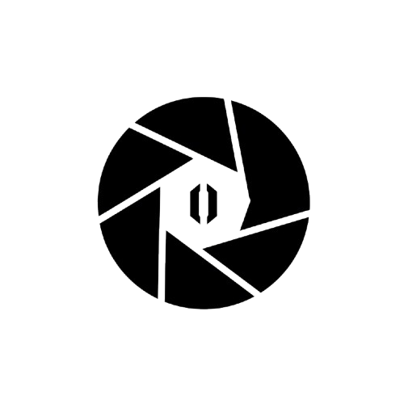

<<<<<<< HEAD
# VisionScan Pro

<div align="center">
  
  
  **A professional camera-based OCR application that extracts numeric data from images with precision and efficiency.**
  
  [](https://flutter.dev/)
  [](https://dart.dev/)
  [](LICENSE)
</div>

## 📱 Features

- **🎯 Precision OCR**: Advanced number extraction using Google ML Kit
- **📸 Smart Camera**: Fixed 4:3 aspect ratio scanning rectangle with responsive sizing
- **📊 Export Options**: CSV, PDF, and JSON export formats
- **📱 Cross-Platform**: Native iOS and Android support
- **🎨 Premium UI**: Neumorphic design with flat, minimal aesthetic
- **📈 History Management**: Complete scan history with search and filtering
- **🔄 Real-time Processing**: Live camera preview with instant OCR results
- **📤 Share Integration**: Built-in sharing capabilities

## 🏗️ Architecture

VisionScan Pro follows **Clean Architecture** principles with a **feature-first** structure:

```
lib/
├── app/                    # App initialization and routing
├── core/                   # Shared utilities, theme, and services
│   ├── database/          # ObjectBox database setup
│   ├── error/             # Custom exceptions and error handling
│   ├── logging/           # Centralized logging system
│   ├── navigation/        # GoRouter configuration
│   ├── services/          # Core services (OCR, file handling)
│   └── theme/             # App theme and design system
├── features/              # Feature-based modules
│   ├── camera/           # Camera functionality and OCR processing
│   ├── history/          # Scan history and management
│   ├── scan_details/     # Individual scan details and export
│   ├── image_viewer/     # Full-screen image viewing
│   └── shared/           # Shared widgets and utilities
└── config/               # Environment and configuration
```

### State Management

- **Riverpod**: Modern state management with code generation
- **AsyncNotifier**: For async operations and loading states
- **Provider Pattern**: Dependency injection and service location

## 🚀 Getting Started

### Prerequisites

- Flutter SDK 3.8.1 or higher
- Dart SDK 3.8.1 or higher
- Android Studio / Xcode for mobile development
- Git for version control

### Installation

1. **Clone the repository**

   ```bash
   git clone https://github.com/your-username/visionscan_pro.git
   cd visionscan_pro
   ```

2. **Install dependencies**

   ```bash
   flutter pub get
   ```

3. **Generate code**
   ```bash
   dart run build_runner build --delete-conflicting-outputs
   ```

4. **Run the application**

   ```bash
   flutter run
   ```

### Platform-Specific Setup

#### Android Setup

1. **Minimum SDK Version**: Android API 21 (Android 5.0)
2. **Permissions**: Add to `android/app/src/main/AndroidManifest.xml`

   ```xml
   <uses-permission android:name="android.permission.CAMERA" />
   <uses-permission android:name="android.permission.WRITE_EXTERNAL_STORAGE" />
   <uses-permission android:name="android.permission.READ_EXTERNAL_STORAGE" />
   ```

#### iOS Setup

1. **Minimum iOS Version**: iOS 16.0
2. **Permissions**: Add to `ios/Runner/Info.plist`

   ```xml
   <key>NSCameraUsageDescription</key>
   <string>This app needs camera access to capture and process images for number extraction.</string>
   <key>NSPhotoLibraryUsageDescription</key>
   <string>This app needs photo library access to select images for processing.</string>
   ```

## 🔧 Technical Implementation

### Rectangle-to-Image Coordinate Mapping

The camera overlay uses a sophisticated coordinate mapping system to ensure accurate OCR processing:

```dart
/// Calculate scanning rectangle with fixed 4:3 aspect ratio and responsive sizing
Rect _getScanningRect(BoxConstraints constraints) {
  final screenWidth = constraints.maxWidth;
  final screenHeight = constraints.maxHeight;

  // Fixed aspect ratio (4:3 for optimal number scanning)
  const aspectRatio = 4 / 3;

  // Responsive sizing - use 85% of screen width for better visibility
  final rectWidth = screenWidth * 0.85;
  final rectHeight = rectWidth / aspectRatio;

  // Center the rectangle
  final left = (screenWidth - rectWidth) / 2;
  final top = (screenHeight - rectHeight) / 2;

  return Rect.fromLTWH(left, top, rectWidth, rectHeight);
}
```

**Key Features:**
- **Fixed 4:3 Aspect Ratio**: Optimized for number scanning
- **85% Screen Width**: Responsive sizing for better visibility
- **Centered Positioning**: Consistent user experience across devices
- **Coordinate Translation**: Seamless mapping between UI and image coordinates

### OCR Implementation

VisionScan Pro uses Google ML Kit for robust number extraction:

```dart
class MLKitOCRService {
  Future<OCRResult> extractNumbersFromImage(
    File imageFile,
    Rect cropRect,
    Size previewSize,
  ) async {
    // 1. Load and preprocess image
    final image = await _loadImage(imageFile);
    
    // 2. Apply coordinate transformation
    final transformedRect = _transformCoordinates(cropRect, previewSize, image);
    
    // 3. Crop image to scanning area
    final croppedImage = await _cropImage(image, transformedRect);
    
    // 4. Run OCR with Google ML Kit
    final textRecognizer = TextRecognizer();
    final recognizedText = await textRecognizer.processImage(croppedImage);
    
    // 5. Extract and validate numbers
    final numbers = _extractNumbers(recognizedText);
    
    // 6. Calculate confidence scores
    final confidence = _calculateConfidence(recognizedText);
    
    return OCRResult(
      extractedNumbers: numbers,
      confidence: confidence,
      fullText: recognizedText.text,
    );
  }
}
```

**Processing Pipeline:**

1. **Image Loading**: Efficient image loading with error handling
2. **Coordinate Transformation**: Precise mapping from UI to image coordinates
3. **Image Cropping**: Focus on the scanning rectangle area
4. **OCR Processing**: Google ML Kit text recognition
5. **Number Extraction**: Regex-based number identification
6. **Confidence Calculation**: Accuracy scoring for results

### Export System

The application supports multiple export formats with proper file generation:

#### CSV Export

```dart
Future<File> exportAsCsv(ScanResult scan) async {
  final csvContent = StringBuffer()
    ..writeln('Scan ID,Timestamp,Confidence,Source,Extracted Numbers')
    ..writeln('${scan.id},${scan.timestamp.toIso8601String()},${(scan.confidence * 100).toStringAsFixed(1)}%,${scan.isFromGallery ? 'Gallery' : 'Camera'},"${scan.extractedNumbers.join('; ')}"');
  
  await file.writeAsString(csvContent.toString());
  return file;
}
```

#### PDF Export

```dart
Future<File> exportAsPdf(ScanResult scan) async {
  final pdf = pw.Document()
    ..addPage(
      pw.Page(
        build: (pw.Context context) {
          return pw.Column(
            children: [
              pw.Text('VISION SCAN PRO - SCAN REPORT', 
                style: pw.TextStyle(fontSize: 24, fontWeight: pw.FontWeight.bold)),
              pw.Text('Scan ID: ${scan.id}'),
              pw.Text('Date: ${scan.timestamp.toLocal()}'),
              pw.Text('Confidence: ${(scan.confidence * 100).toStringAsFixed(1)}%'),
              // ... more content
            ],
          );
        },
      ),
    );
  
  final bytes = await pdf.save();
  await file.writeAsBytes(bytes);
  return file;
}
```

## 📚 Library Choices & Technical Decisions

### Core Dependencies

| Library | Purpose | Version | Rationale |
|---------|---------|---------|-----------|
| **flutter_riverpod** | State Management | ^2.6.1 | Modern, type-safe state management with excellent DevTools support |
| **go_router** | Navigation | ^15.0.0 | Declarative routing with deep linking support |
| **objectbox** | Local Database | ^2.3.1 | High-performance NoSQL database for scan history |
| **google_ml_kit** | OCR Processing | ^0.20.0 | Google's ML Kit for accurate text recognition |
| **camera** | Camera Access | ^0.11.2 | Native camera integration with preview support |
| **pdf** | PDF Generation | ^3.11.3 | Professional PDF document creation |
| **share_plus** | File Sharing | ^2.6.1 | Cross-platform file and text sharing |

### Design Decisions

1. **Clean Architecture**: Ensures maintainability and testability
2. **Feature-First Structure**: Logical organization by business features
3. **Riverpod State Management**: Type-safe, performant state handling
4. **ObjectBox Database**: Fast local storage for scan history
5. **Neumorphic Design**: Modern, accessible UI with premium feel
6. **Responsive Layout**: Adaptive UI for different screen sizes

## 🎯 Known Limitations

### Current Limitations
- **Language Support**: Currently optimized for English number recognition
- **Image Quality**: Requires good lighting and contrast for optimal results
- **Number Types**: Primarily designed for standard numeric formats
- **Batch Processing**: Single image processing at a time
- **Offline Processing**: Requires device ML Kit models

### Performance Considerations
- **Memory Usage**: Large images may impact performance on low-end devices
- **Processing Time**: OCR processing can take 1-3 seconds depending on device
- **Storage**: Scan history accumulates over time (implemented cleanup)

### Platform-Specific Notes
- **iOS**: Camera permissions require user approval
- **Android**: Storage permissions needed for file exports
- **Web**: Not currently supported (camera API limitations)

## 🚧 Potential Improvements

### Short-term Enhancements
- [ ] **Multi-language Support**: Expand OCR to support multiple languages
- [ ] **Batch Processing**: Process multiple images simultaneously
- [ ] **Cloud Sync**: Backup scans to cloud storage
- [ ] **Advanced Filters**: More sophisticated search and filtering options
- [ ] **Export Templates**: Customizable PDF and CSV export formats

### Long-term Roadmap
- [ ] **AI Enhancement**: Custom ML models for specific number types
- [ ] **Real-time Processing**: Live OCR on camera preview
- [ ] **Team Collaboration**: Shared scan libraries and team features
- [ ] **API Integration**: Connect with external number validation services
- [ ] **Web Dashboard**: Browser-based scan management interface

### Performance Optimizations
- [ ] **Image Compression**: Automatic image optimization before processing
- [ ] **Caching System**: Intelligent caching for faster repeated operations
- [ ] **Background Processing**: OCR processing in background threads
- [ ] **Memory Management**: Improved memory usage for large image sets

## 📱 Demo Videos

### iOS Demo
<video width="100%" controls>
  <source src="assets/recordings/ios.MP4" type="video/mp4">
  Your browser does not support the video tag.
</video>

**iOS Demo Features:**
- Camera interface with scanning rectangle
- Real-time number capture and OCR processing
- History screen with search and filtering
- Export functionality (CSV, PDF, JSON)
- Share capabilities
- Neumorphic UI design

### Android Demo
<video width="100%" controls>
  <source src="assets/recordings/android.mp4" type="video/mp4">
  Your browser does not support the video tag.
</video>

**Android Demo Features:**
- Cross-platform consistency
- Optimized performance
- Native Android UI elements
- Smooth camera operations

## 🤝 Contributing

We welcome contributions! Please see our [Contributing Guidelines](CONTRIBUTING.md) for details.

### Development Setup
1. Fork the repository
2. Create a feature branch (`git checkout -b feature/amazing-feature`)
3. Commit your changes (`git commit -m 'Add amazing feature'`)
4. Push to the branch (`git push origin feature/amazing-feature`)
5. Open a Pull Request

## 📄 License

This project is licensed under the MIT License - see the [LICENSE](LICENSE) file for details.

## 🙏 Acknowledgments

- **Google ML Kit** for powerful OCR capabilities
- **Flutter Team** for the amazing framework
- **Riverpod** for excellent state management
- **ObjectBox** for high-performance local storage
- **Community Contributors** for feedback and improvements

## 📞 Support

For support, email mehuldadlani13@gmail.com 

---

<div align="center">
  <p>Made with ❤️ by the VisionScan Pro Team</p>
  <p>
    <a href="https://github.com/mehuldadlani/VisionScan-Pro">GitHub</a>
  </p>
</div>
